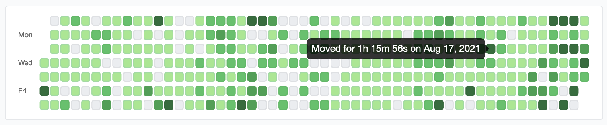
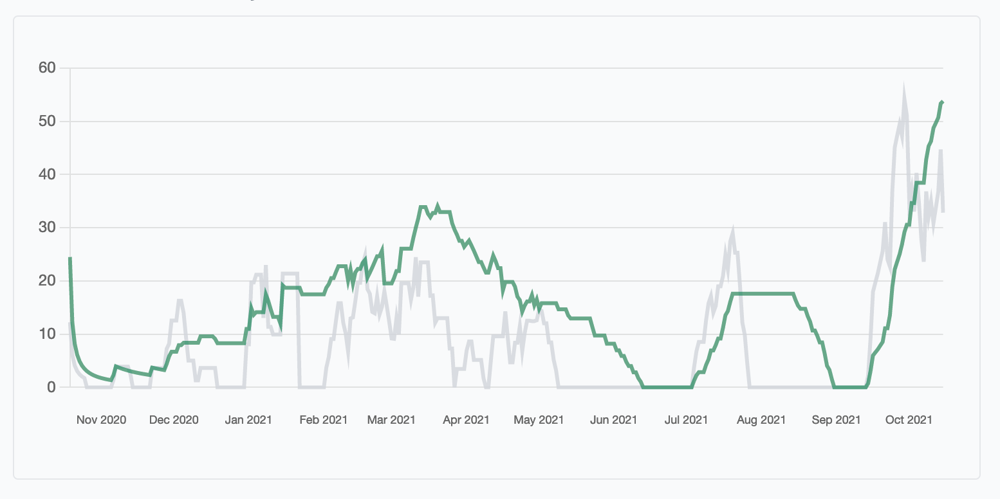

# StraMate

> A self-hosted data analyzer for your Strava activities

## Features

- [x] Activities heat map
- [x] Fitness & fatigue performance chart
- [x] Heart rate zones chart
- [x] Interactive 3D route map
- [x] Athlete RSS feed

More about performance chart: https://github.com/manhtai/stramate/wiki/Training-load:-Fitness-&-Fatigue

## Notice

You should host it yourself, don't give your data to arbitrary people on the internet.


## Demo





## Local setup

1. Install NodeJS and Python Poetry first

2. Create `.env` file in the project root

```
# Strava sync
STRAVA_CLIENT_ID=xxxxx
STRAVA_CLIENT_SECRET=xxxxxxxxxxxxxxxxxxxxxxxxxxxxxxxxxxxxxxxx

# Activity map
MAPBOX_ACCESS_TOKEN=pk.xxxxxxxxxxxxxxxxxxxxxxxxxxxxxxxxxxxxxxxxxxxxxxxxxxxxxxxxxxxxxxxxxxxxxxxxxxxxxxxxxxxxxx

# Production mode
ENV=production

# Disable new registration
DISABLE_REGISTRATION=true
```

- Strava keys: https://www.strava.com/settings/api
- Mapbox token: https://account.mapbox.com/


3. Install dependencies and start server

```sh
poetry install
poetry run python manage.py tailwind install
poetry run python manage.py migrate
poetry run honcho start
```


## Deployment

See [deploy.sh](./deploy.sh) for instruction on Ubuntu.
